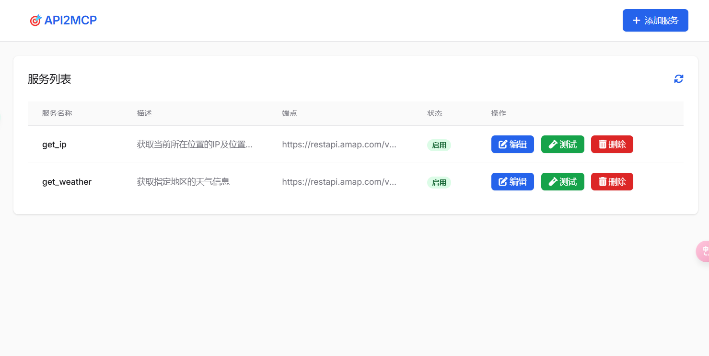

# API2MCP
API2MCP是一个用于封装和管理API服务的工具，支持将各种API服务统一封装为标准的MCP服务，提供统一的访问方式。

## 功能特点

- [ ] 通过Web界面或配置文件管理API服务
- [ ] 支持多种API认证方式（无认证、Basic认证、Token认证、OAuth认证）
- [ ] 提供标准API、MCP_SSE流式(Web服务器)和MCP_标准输入输出（命令行调用）三种访问方式
- [ ] 内置服务测试功能
- [ ] 完善的日志记录
  
- 当前可通过'config.yaml'配置文件进行API倒入，Web页面暂不可用

- higress https://higress.cn/ai/mcp-server/  Nacos3.0 已实现类似功能

## 功能截图

